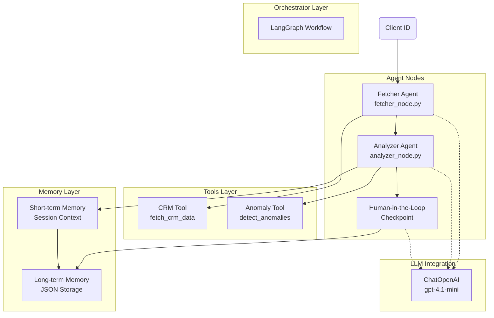
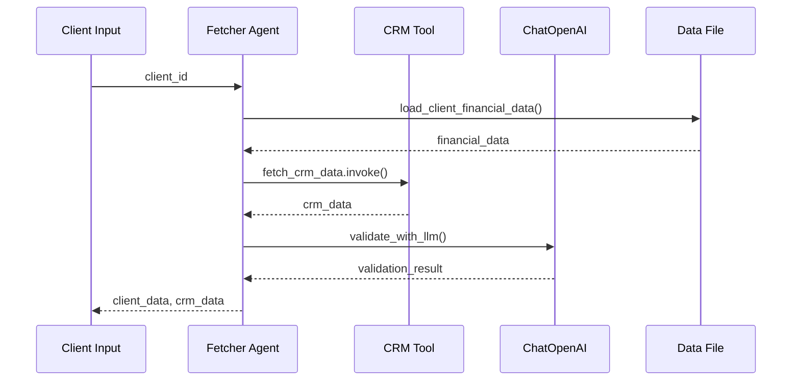
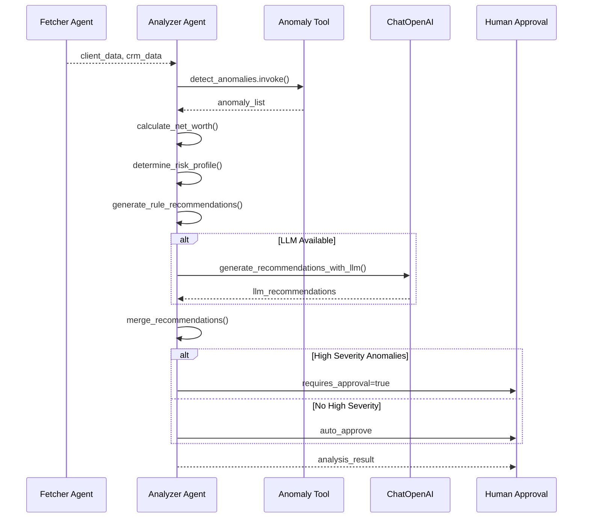
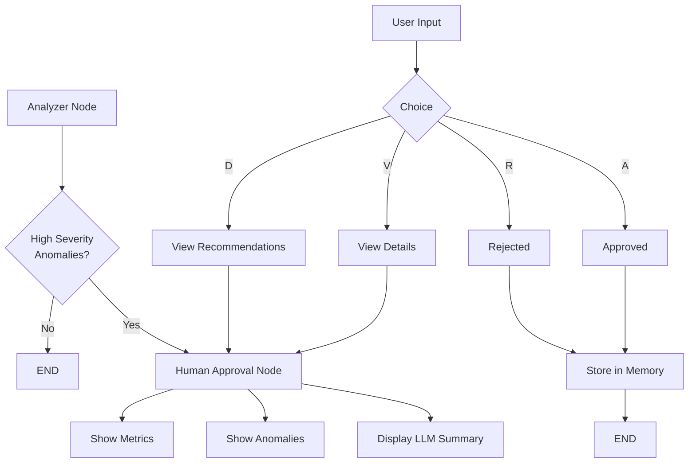
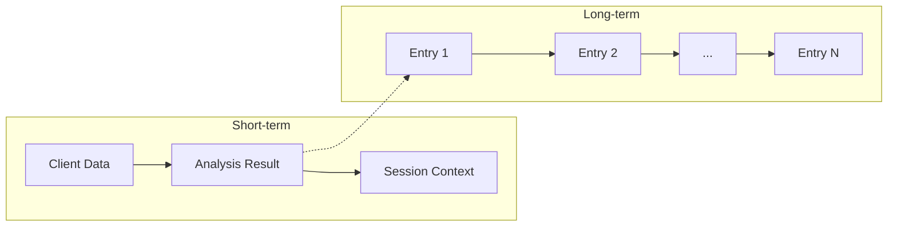

# Wealth Advisor Assistant

A multi-agent AI system for financial analysis powered by LangChain/LangGraph and ChatOpenAI. The system orchestrates specialized agents (Fetcher, Analyzer) to analyze client financial data, detect anomalies, and generate recommendations with human-in-the-loop approval for high-severity issues.

## Architecture Overview



## Project Structure

```
Wealth Advisor Assistant/
├── agents/
│   ├── fetcher_node.py         # Data fetcher agent node
│   └── analyzer_node.py        # Financial analyzer agent node
├── graph/
│   └── workflow.py             # LangGraph workflow definition
├── memory/
│   └── memory_store.py         # Two-tier memory system
├── tools/
│   ├── crm_tool.py             # CRM data fetching tool
│   └── anomaly_tool.py        # Anomaly detection tool
├── state/
│   └── agent_state.py          # Pydantic state schema
├── utils/
│   ├── logger.py               # Logging setup
│   └── llm_client.py           # ChatOpenAI client
├── data/
│   └── mock_client_data.json   # Mock client data
├── main.py                     # CLI entry point
├── app.py                      # Streamlit UI
├── requirements.txt            # Dependencies
└── .env                        # Environment config
```

## Agent Interactions and Flow

### 1. Fetcher Agent

**Purpose**: Retrieve and prepare client financial data from local storage and CRM.

**Inputs**:
- `client_id`: Unique client identifier (e.g., "C-12345")

**Outputs**:
- `client_data`: Financial data (accounts, transactions, risk tolerance)
- `crm_data`: Demographics (age, dependents, income, life events)
- `data_validation`: Quality assessment results

**LLM Enhancement**:
- Validates data completeness using ChatOpenAI
- Generates decision on whether to flag data for manual review

**Tool Usage**:
- `fetch_crm_data`: LangChain `@tool` decorated function for CRM lookup



### 2. Analyzer Agent

**Purpose**: Perform financial analysis including net worth calculation, risk profiling, anomaly detection, and recommendation generation.

**Inputs**:
- `client_data`: Financial accounts and transactions
- `crm_data`: Client demographics and life events

**Outputs**:
- `net_worth`: Calculated total net worth
- `risk_profile`: Determined risk tolerance (conservative/moderate/aggressive)
- `anomalies`: Detected transaction anomalies with severity
- `recommendations`: Combined rule-based + LLM-enhanced recommendations
- `confidence_score`: Analysis confidence (0.85 rule-based, 0.92 LLM-enhanced)
- `requires_approval`: Boolean flag for high-severity anomalies

**Anomaly Detection Rules**:
- Large transactions (>$10,000) -> High severity
- High transaction frequency (>5/day) -> Medium severity
- Unusual transaction locations -> Low severity

**LLM Enhancement**:
- Generates enriched recommendations using client profile context
- Provides personalized financial advice based on life events



### 3. Human-in-the-Loop Checkpoint

**Purpose**: Require human approval when high-severity anomalies are detected.

**Trigger Conditions**:
- Any anomaly with `severity == "high"` detected

**LLM Enhancement**:
- Generates human-readable approval summary using ChatOpenAI
- Provides context for advisor decision-making

**Approval Options**:
- `[A] Approve`: Proceed with recommendations
- `[R] Reject`: Flag for manual review
- `[V] View`: See full analysis details
- `[D] Details`: View all recommendations



### 4. Memory Layer

**Short-term Memory**:
- Session-scoped context dictionary
- Stores current workflow state
- Cleared on session end

**Long-term Memory**:
- Persistent JSON file (`memory_store.json`)
- Keeps last 100 analysis entries
- LLM-generated summaries for each entry



## Key Decisions and Trade-offs

### LLM Integration Decision

**Decision**: Use ChatOpenAI from `langchain-openai` for enhanced analysis.

**Trade-offs**:
- Adds API cost per request
- Provides intelligent validation and recommendations
- Enables natural language summaries

**Fallback**: System operates with rule-based analysis only if LLM unavailable (confidence drops from 0.92 to 0.85).

```python
# Graceful fallback pattern used throughout
try:
    from utils.llm_client import generate_recommendations_with_llm
    LLM_AVAILABLE = True
except ImportError:
    LLM_AVAILABLE = False
    logger.warning("LLM not available - using rule-based only")
```

### Tool Abstraction Design

**Decision**: Use LangChain's `@tool` decorator for tool definitions.

**Benefits**:
- Standardized tool interface compatible with LangGraph
- Automatic JSON schema generation for inputs
- Built-in logging and error handling

```python
@tool
def fetch_crm_data(client_id: str) -> Dict[str, Any]:
    """Tool documentation becomes schema."""
    # Implementation
    return crm_data
```

### Memory Architecture

**Decision**: Two-tier storage (short-term + long-term JSON).

**Trade-offs**:
- Simpler than vector-based embeddings
- Sufficient for structured financial data
- No semantic search capability

**Enhancement**: LLM generates summaries for stored analyses when available.

### Human-in-the-Loop Design

**Decision**: Checkpoint after anomaly detection, not after every step.

**Trade-offs**:
- Balances automation with oversight
- LLM summary provides context for decision
- Minor latency increase for approval flow

## Assumptions Made

1. **Environment**: OpenAI API key available in `.env` file
2. **Model**: Default model `gpt-4.1-mini` (cost-effective for this use case)
3. **Data**: Mock data exists in `data/mock_client_data.json`
4. **CRM**: Mock CRM tool (no real API integration)
5. **Concurrency**: Single-user operation (no multi-user handling)
6. **Storage**: File-based JSON acceptable for memory persistence

## Installation and Setup

### 1. Install Dependencies

```bash
pip install -r requirements.txt
```

**Required packages**:
- `langchain >= 0.3.0` - Agent framework
- `langgraph >= 0.2.0` - Workflow orchestration
- `langchain-openai >= 0.1.0` - OpenAI integration
- `pydantic >= 2.0.0` - State schema validation
- `python-dotenv >= 1.0.0` - Environment configuration
- `streamlit >= 1.28.0` - Web UI

### 2. Configure Environment

Create or update `.env` file in project root:

```env
OPENAI_API_KEY=your_openai_api_key_here
LLM_MODEL=gpt-4.1-mini
```

**Note**: If `OPENAI_API_KEY` is not set, the system falls back to rule-based analysis only.

### 3. Run the Application

#### Option A: CLI Interface

```bash
python main.py
```

Enter a client ID when prompted. Example session:

```
Wealth Advisor Assistant - Multi-Agent System
Using LangChain/LangGraph

Enter client ID (or 'quit' to exit): C-12345
```

The workflow executes: Fetcher -> Analyzer -> (Human Approval if needed) -> Memory Store.

#### Option B: Streamlit UI

```bash
streamlit run app.py
```

Open http://localhost:8501 in your browser.

**Streamlit Features**:
- Client ID selection
- Real-time workflow visualization
- Memory panel (session + history)
- Analysis results display
- Human approval interface

## Testing Available Clients

| Client ID | Name | Profile | Expected Behavior |
|-----------|------|---------|-------------------|
| C-12345 | John Smith | Multiple anomalies | Triggers human approval |
| C-67890 | Jane Doe | Lower anomaly count | Auto-approves |

### Client C-12345 Details
- Net Worth: ~$0 (after mortgage liability)
- Risk Profile: Moderate
- Anomalies: High-severity large transactions, high frequency day
- **Triggers**: Human-in-the-loop checkpoint

### Client C-67890 Details
- Net Worth: ~$240,000
- Risk Profile: Aggressive
- Anomalies: Fewer detected
- **Behavior**: Auto-approves without human intervention

## Error Handling

- **LLM Unavailable**: Falls back to rule-based analysis with reduced confidence score
- **Missing Client Data**: Returns error with descriptive message
- **Invalid Client ID**: Loads default CRM data, proceeds with analysis
- **Workflow Failure**: Logs error, returns partial state with error list

## Features Summary

- **Multi-Agent Architecture**: Fetcher + Analyzer with LangGraph orchestration
- **LLM Enhancement**: ChatOpenAI for validation, recommendations, approval summaries
- **Two-tier Memory**: Short-term session + long-term JSON storage
- **Human-in-the-Loop**: Approval checkpoint for high-severity anomalies
- **Tool Abstraction**: Clean LangChain `@tool` decorated interfaces
- **Graceful Fallback**: Rule-based operation when LLM unavailable
- **Dual Interfaces**: CLI and Streamlit web UI

## File Reference

| File | Purpose |
|------|---------|
| `main.py` | CLI entry point, interactive client input |
| `app.py` | Streamlit web interface |
| `graph/workflow.py` | LangGraph state machine definition |
| `agents/fetcher_node.py` | Data retrieval and validation |
| `agents/analyzer_node.py` | Financial analysis and recommendations |
| `tools/crm_tool.py` | Mock CRM data fetcher |
| `tools/anomaly_tool.py` | Transaction anomaly detector |
| `state/agent_state.py` | Pydantic state schema |
| `memory/memory_store.py` | Two-tier memory implementation |
| `utils/llm_client.py` | ChatOpenAI wrapper with fallback |
| `data/mock_client_data.json` | Mock client financial data |